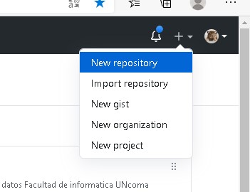
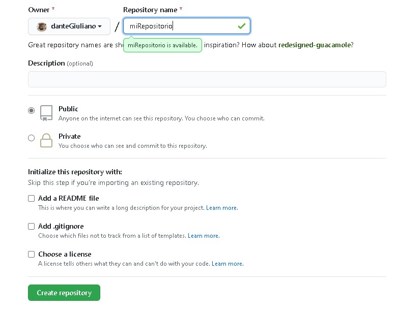
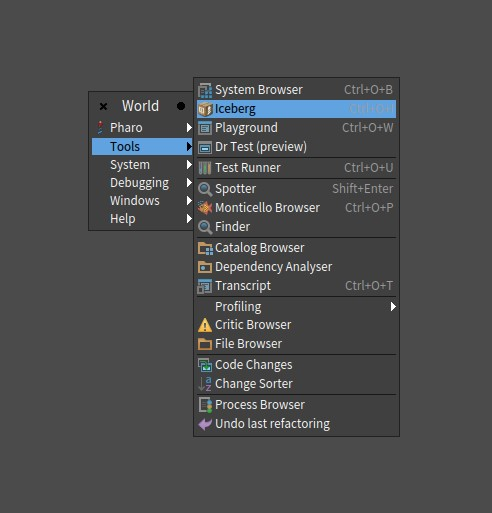
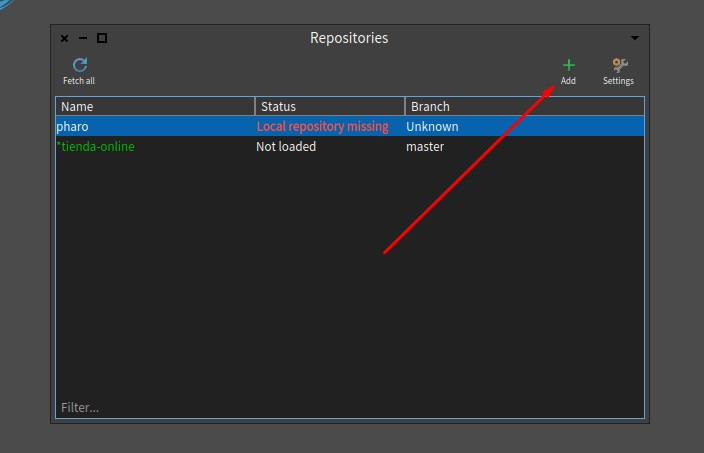
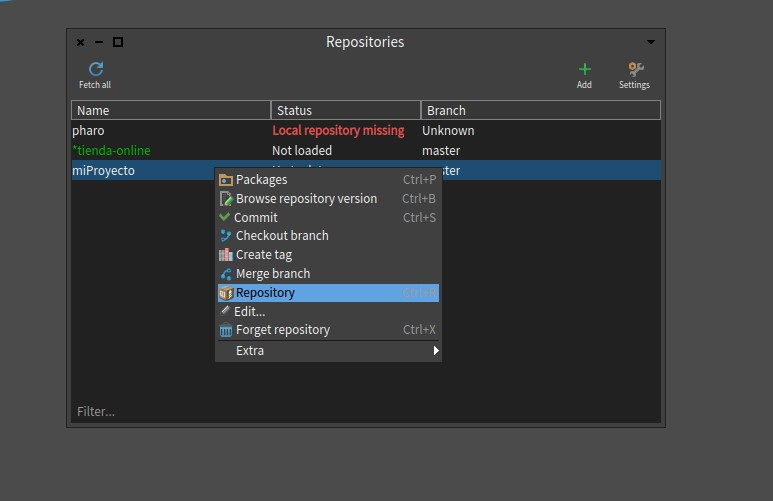
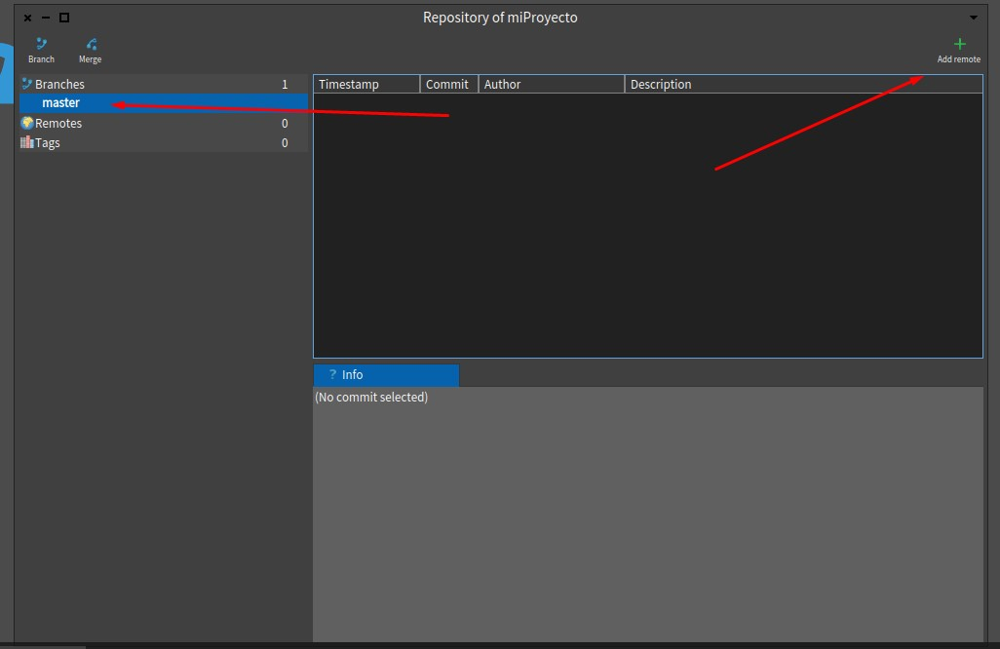
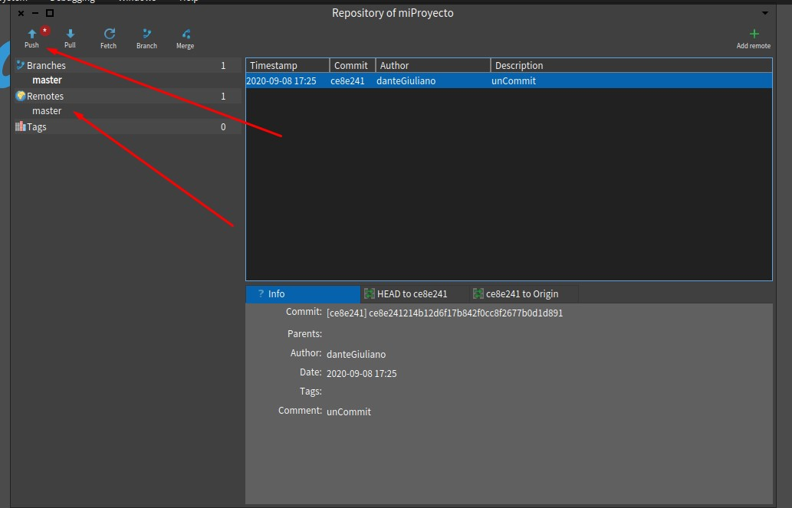
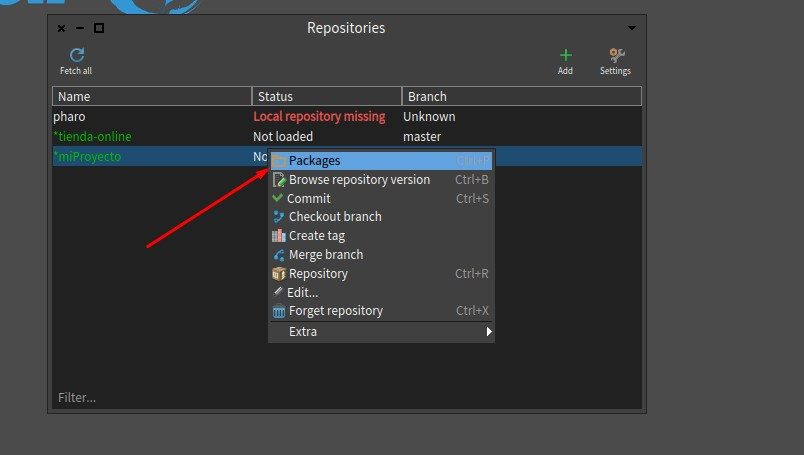
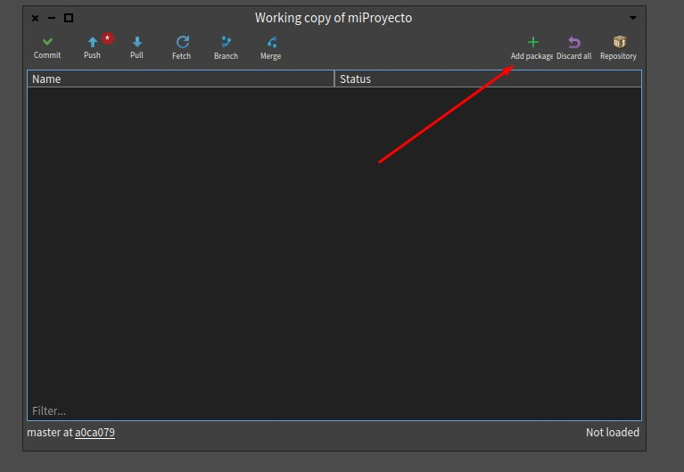

# Tutorial para usar GitHub con Pharo 

## Primera parte

Los pasos a seguir en esta primera parte se realizarán en GitHub.
Se supone que el usuario ya tiene una cuenta en la página y que
además se encuentra en ella.

El primer paso será crear un nuevo repositorio.

Daremos un nombre y una descripción a nuestro repositorio.
GitHub no permite crear repositorios privados(Si usted tiene git registrado con cuenta institucional se puede acceder a uno)
así que dejaremos la opción pública que viene por defecto.

Por el momento, tampoco asignaremos una licencia, un README
ni un fichero de exclusión (gitignore).

Lo que haremos sera copiar el link del repositorio , preferiblemente http. (Si es usuario experimentado puede usar ssh)

## Segunda parte

Para esta parte del tutorial, iniciaremos Pharo, y nos dirigiremos a Tools->Iceberg.

>Nota:
>*Iceberg es un plugin/addon, que traen las imagenes de Pharo por defecto, es un servicio de repositorios.*

Una vez clickeado en Iceberg se abrira una ventana emergente, lo que haremos sera clickear en **+add** añadir un nuevo repositorio local.

>*el servicio de Iceberg nos da una lista de opciones que podemos usar, en caso de querer clonar un repositorio ya existente.*

Nosotros por el momento solo haremos un repositorio local.

Si hicimos todo bien, deberia figurarnos el repositorio en nuestra ventana.

Como siguiente paso haremos click derecho. y se desplegara una lista. ahi podemos interactuar con nuestro repositorio.

lo que haremos sera configurar y enlazar nuestro repositorio local con el repositorio creado en github.

Esta ventana es muy importante, en esta ventana se administran todos los commits,ramas y authores en el repositorio local. 
podemos ver que por defecto Iceberg nos crea un Brach master. esto representa nuestro usuario local. lo haremos sera crear un usuario 
que pueda recibir las actualizaciones del repositorio local. por lo que iremos a **+add remote** 

Deberia abrirse una ventana emergente donde se nos pide 2 cosas. 

1. identificacion del branch o usuario(puede ser cualqueira)
2. la url donde se encuentra ese repositorio(es el link http guardado del paso 1).

>Nota: *si no trabajamos en equipo, es recomendable solo tener una rama denotada master, por convencion*

al aceptar los cambios posiblemente se nos pedira un usuario y contraseña, eso es referido a nuestra cuenta gitHub.
logeados con exito. Iceberg gestionara todo automaticamente, ahora si todo salio bien, notaremos cambios que antes no estaban.

### Felicitaciones, ya tienes enlazado un repositorio de Pharo, con gitHub 

## Como añadir proyectos?

lo que haremos sera dirigirnos a nuestra ventana de Icerberg, seleccionando el repositorio haremos click derecho y presionaremos en Packages.

ahora solo añadiremos nuestro package al working directory presionando en **add package** .

Listo :) ahora podremos commitear y pushear a github.

